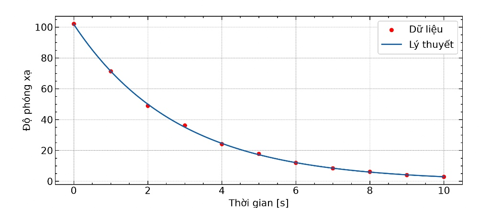
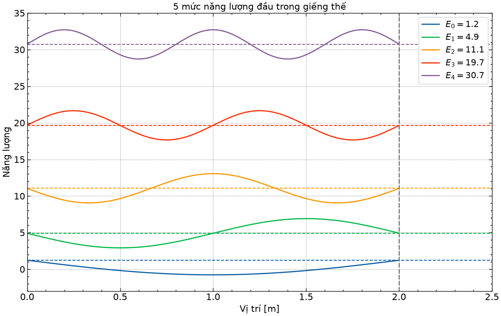

# Physics-Exercise
Some of my mini projects on physics
# Đồ thị kết quả khớp số liệu (file: radiation_curvefitting.py):

# Mô phỏng các mức năng lượng trong giếng thế (PP số) (file: numerical.py): 

# Hiệu ứng cánh bướm (file: chaos.py): 

